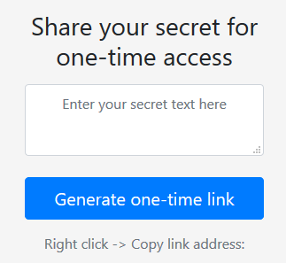

# SecretKeeper
Have you ever wanted to share something and make sure it's gone once it is accessed? This tiny web-based service allows you to do exactly that - to share secrets via one-time links.



Powered by ASP.NET Core 2.1 and Docker.

# Run
SecretKeeper is built in, with and for Docker on *Windows* (so far). To get it up and running, simply run:

```
docker-compose -f docker-compose.yml -f docker-compose.override.yml up
```

Or, in 2 steps:

```
docker-compose -f docker-compose.yml -f docker-compose.override.yml --no-ansi build

docker-compose -f docker-compose.yml -f docker-compose.override.yml --no-ansi up -d --no-build --force-recreate --remove-orphans
```

By default, the container publishes the port 44340 (https) to the host and makes it accessbile to other compiters on the network (firewall rules need to be added).

# Usage
Open `https://<your IP>:44340/index` in a browser. Enter a secret text to be shared and press *Generate one-time link*. Copy the link and share it with someone. When the link is accessed, the content is rendered to the browser. At the same time, the link and the secret are erased and gone forever.

# Security features
- Secrets are stored encrypted in the in-memory database and removed once accessed.
- All secrets expire after 5 min (default).
- Configured with HTTPS by default, certificate is imported from PFX file under `Certificates/cert.pfx`.
- Links generated by computing SHA256 of random numbers.

# API
Secrets can be generated by posting a json payload to the endpoint: 
```
POST /api/secret 
Host: <IP>
Content-Type: application/json
Cache-Control: no-cache

{
"Value": "<SECRET HERE>"
}
```

The response returns a link to the secret.

# Roadmap
- [x] Encrypt secrets before storing them in the DB
- [x] Prettify UI
- [ ] Add Linux support
- [ ] Implement file sharing
- [ ] Add integration to secret providers (Hashicorp Vault, Azure KeyVault)
